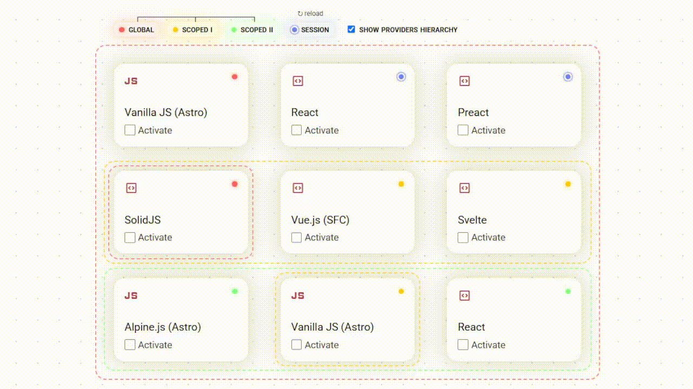

<div align="center">

# astro-context

<p align="center">
  <a href="https://www.npmjs.com/package/astro-context">
    
  </a>
</p>

This package provides a way to use DOM hierarchy to manage context state.\
It's framework-agnostic\* and not limited to Astro.

<a href="https://valooford.github.io/astro-context/demo/">
  
</a>
<div>
  <a href="https://valooford.github.io/astro-context/demo/">Demo</a>
  |
  <a href="./demo/">Sources</a>
</div>

<i>\* - each tile here is a different labeled UI framework</i>

<br>

<p align="center">
  <a href="https://github.com/valooford/astro-context/stargazers">Become a 🧙Stargazer</a>
  |
  <a href="https://github.com/valooford/valooford#support">Support the author</a>
</p>

---

</div>

<div align="center">

```bash
npm install -D astro-context
```

</div>

## Basic Usage

1. **Create a context** - Define your shared state:

```ts
// src/contexts/counter.ts
import { createContext } from 'astro-context'

export const CounterContext = createContext('counter', 0)
```

2. **Wrap components with ContextProvider** - Provide scope for your components:

```astro
---
// src/pages/index.astro

import { ContextProvider } from 'astro-context'

import ReactCounter from '../components/ReactCounter'
import VueCounter from '../components/VueCounter'
import CounterContext from '../contexts/counter'
---

<ContextProvider context={CounterContext}>
  <ReactCounter client:load />
  <VueCounter client:load />
</ContextProvider>
```

3. **Use context in components** - Access and modify state in your framework components:

```tsx
// React component

import { useContext } from 'astro-context/react'

import { CounterContext } from '../contexts/counter'

export default function ReactCounter() {
  const ref = useRef<HTMLDivElement>(null)
  const [count, setCount] = useContext(CounterContext, ref)

  return (
    <div ref={ref}>
      <p>Count: {count}</p>
      <button onClick={() => setCount(count + 1)}>Increment</button>
    </div>
  )
}
```

```vue
<!-- Vue component -->

<script setup>
import { useContext } from 'astro-context/vue'

import { CounterContext } from '../contexts/counter'

const [count, setCount] = useContext(CounterContext)
</script>

<template>
  <div>
    <p>Count: {{ count }}</p>
    <button @click="setCount(count + 1)">Increment</button>
  </div>
</template>
```

## Key Features

- **Framework Agnostic**: Works with React, Preact, SolidJS, Vue, Svelte, and vanilla JS (Alpine.js included)
- **Scoped State**: Create isolated state scopes using `ContextProvider`
- **Persistence**: Scopes data can be persisted to localStorage
- **TypeScript**: Full TypeScript support with proper type inference
- **Astro Optimized**: Designed specifically for Astro's island architecture
  - _yet the context mechanism can be useful in any web application_

# API Reference

## Table of Contents

- [Functions](#functions)
  - [`createStore()` function](#createstore-function)
  - [`getDefaultStore()` function](#getdefaultstore-function)
  - [`useContext()` function](#usecontext-function)
- [Variables](#variables)
  - [`createContext` function](#createcontext-function)
- [Classes](#classes)
  - [`Context` class](#context-class)
  - [`ContextConfig` class](#contextconfig-class)
  - [`ScopedContext` class](#scopedcontext-class)
  - [`Store` class](#store-class)
- [Namespaces](#namespaces)
  - [`Context` namespace](#context-namespace)
  - [`ContextConfig` namespace](#contextconfig-namespace)
- [Type Aliases](#type-aliases)
  - [`_GetInitialValueFn` type](#_getinitialvaluefn-type)
  - [`StorageVariants` type](#storagevariants-type)
- [Framework Utils](#framework-utils)

## Functions

### `createStore()` function

Creates a new Store with a stable scope name.

Useful if you want multiple subtrees to share the same context scope.

It also allows you to create persistent scope (to sync via localStorage for example).

**Signature:**

```ts
createStore: (name: string) => Store
```

#### Parameters

name - Stable name for the store scope

**Returns:**

&#x20;A new Store instance

#### Example

```ts
const context = createContext('local', false, { storage: 'localStorage' })
const sharedStore = createStore('local_1')
// . . .
<ContextProvider context={LocalContext} store={sharedStore}>...</ContextProvider>
// . . .
<ContextProvider context={LocalContext} store={sharedStore}>...</ContextProvider>
```

#### Public

### `getDefaultStore()` function

Gets the default global store instance.

Useful if you want to create a global-scoped subtree under another scope.

**Signature:**

```ts
getDefaultStore: () => Store
```

**Returns:**

&#x20;The default global store

#### Example

```ts
const globalStore = getDefaultStore()
// . . .
<ContextProvider context={LocalContext}>
  <ContextProvider context={LocalContext} store={globalStore}>...</ContextProvider>
</ContextProvider>
```

#### Public

### `useContext()` function

Creates a ScopedContext instance for the given context, automatically determining the appropriate store scope.

This function analyzes the DOM hierarchy to find the correct ContextProvider scope or falls back to global scope.

**Signature:**

```ts
useContext: <T>(context: Context<T, any>, node?: HTMLElement) =>
  ScopedContext<T>
```

#### Parameters

context - The context to create a scoped instance for

node - Optional DOM element to analyze for context scope (defaults to global scope)

**Returns:**

&#x20;A ScopedContext instance bound to the appropriate store

#### Example

```ts
const context = useContext(LocalContext, node)
context.listen((value) => console.log('Changed:', value))
context.value = true
```

#### Public

## Variables

### **`createContext` function**

Creates a new Context instance with the specified name, initial value, and configuration.

This is the primary way to create context instances for state management.

**Signature:**

```ts
createContext: CreateContextFn
```

#### Parameters

name - Unique identifier for the context

initialValue - Initial value or function that returns the initial value

config - Optional configuration for storage and serialization

**Returns**

&#x20;A new Context instance

**Example**

```ts
const LocalContext = createContext('local', false)
const SessionContext = createContext('session', false, {
  storage: 'localStorage',
})
```

#### Public

## Classes

### `Context` class

A context object that manages state across different scopes and storage types.

Provides methods to get, set, and manage context values with support for memory and localStorage persistence.

**Signature:**

```ts
declare class Context<T, _Info extends [`storage:${StorageVariants}`]>
```

#### Properties

##### `name` property

The unique name identifier for this context.

**Signature:**

```ts
readonly name: string;
```

#### Methods

##### `get()` method

Retrieves the current value of the context for the specified scope.

**Signature:**

```ts
get<S extends string | undefined = undefined>(scope?: S): S extends undefined ? T : T | undefined;
```

#### Parameters

scope - Optional scope identifier. If undefined, returns the global value

**Returns:**

&#x20;The context value for the specified scope

###### Example

```ts
const value = LocalContext.get()
const scopedValue = LocalContext.get('my-scope')
```

##### `providerTraits()` method

Generates provider traits for use in ContextProvider components.

**Signature:**

```ts
providerTraits(store?: Store): {
    'data-context-id': string;
    'data-context-scope': string;
    'data-context-stable': boolean | undefined;
  };
```

#### Parameters

store - Optional store instance to generate traits for

**Returns:**

&#x20;Object containing data attributes for the provider

###### Example

```tsx
const traits = LocalContext.providerTraits()
// . . .
<context-provider {...traits}>
```

##### `set()` method

Sets the value of the context for the specified scope.

**Signature:**

```ts
set(value: T, scope?: Context.inferStorage<Context<any, _Info>> extends 'memory' ? string : 'global'): void;
```

#### Parameters

value - The new value to set

scope - Optional scope identifier. Defaults to 'global'

###### Example

```ts
LocalContext.set(true)
LocalContext.set(false, 'my-scope')
```

### `ContextConfig` class

Configuration class for Context instances that defines storage type and serialization behavior.

Controls how context values are stored and serialized across different storage mechanisms.

**Signature:**

```ts
declare class ContextConfig<T, Storage extends StorageVariants = 'memory'>
```

#### Properties

##### `storage` property

The storage type to use for this context.

**Signature:**

```ts
readonly storage: Storage;
```

##### `stringify` property

Function used to serialize values for storage.

**Signature:**

```ts
readonly stringify: (value: T) => string;
```

### `ScopedContext` class

A scoped context provides a convenient interface for interacting with a context within a specific store scope.

It wraps the store's methods and provides reactive value access through getter/setter properties.

**Signature:**

```ts
declare class ScopedContext<T>
```

#### Properties

##### `listen` property

Subscribes to changes in the context value without immediately calling the callback.

**Signature:**

```ts
listen: (callback: (value: T) => void) => () => void;
```

##### `subscribe` property

Subscribes to changes in the context value and immediately calls the callback with the current value.

**Signature:**

```ts
subscribe: (callback: (value: T) => void) => () => void;
```

##### `value` property

The current value of the context.

Can be set to update the context value.

**Signature:**

```ts
get value(): T;

set value(value: T);
```

###### Example

```ts
const currentValue = scopedContext.value
scopedContext.value = true
```

### `Store` class

A store manages context values within a specific scope and provides subscription capabilities.

Stores can be scoped to different contexts and provide reactive updates when values change.

**Signature:**

```ts
declare class Store
```

#### Properties

##### `scope` property

The unique scope identifier for this store.

**Signature:**

```ts
readonly scope: string;
```

##### `scopeName` property

Optional stable name for the scope, used for persistent scopes.

**Signature:**

```ts
readonly scopeName: string | undefined;
```

#### Methods

##### `get()` method

Retrieves the current value of a context from this store's scope.

**Signature:**

```ts
get<T>(context: Context<T, any>): T;
```

#### Parameters

context - The context to get the value from

**Returns:**

&#x20;The current value of the context

###### Example

```ts
const value = store.get(LocalContext)
```

##### `listen()` method

Subscribes to changes in a context value without immediately calling the callback.

**Signature:**

```ts
listen<T>(context: Context<T, any>, callback: (value: T) => void): () => void;
```

#### Parameters

context - The context to listen to

callback - Function to call when the value changes

**Returns:**

&#x20;Unsubscribe function

###### Example

```ts
const unsubscribe = store.listen(LocalContext, (value) => {
  console.log('Value changed:', value)
})
unsubscribe() // Stop listening
```

##### `set()` method

Sets the value of a context in this store's scope and notifies subscribers.

**Signature:**

```ts
set<T>(context: Context<T, any>, value: T): void;
```

#### Parameters

context - The context to set the value for

value - The new value to set

###### Example

```ts
store.set(LocalContext, true)
```

##### `subscribe()` method

Subscribes to changes in a context value and immediately calls the callback with the current value.

**Signature:**

```ts
subscribe<T>(context: Context<T, any>, callback: (value: T) => void): () => void;
```

#### Parameters

context - The context to subscribe to

callback - Function to call when the value changes

**Returns:**

&#x20;Unsubscribe function

###### Example

```ts
const unsubscribe = store.subscribe(LocalContext, (value) => {
  console.log('Current value:', value)
})
unsubscribe() // Stop listening
```

## Namespaces

### `Context` namespace

#### Type Aliases

##### `inferInfo` type

Infers the info type from a Context instance.

**Signature:**

```ts
type inferInfo<C extends Context<any, any>> =
  C extends Context<any, infer Info> ? Info : never
```

##### `inferStorage` type

Infers the storage type from a Context instance.

**Signature:**

```ts
type inferStorage<C extends Context<any, any>> =
  C extends Context<any, infer Storage>
    ? Storage extends [`storage:${infer S}`]
      ? S
      : never
    : never
```

### `ContextConfig` namespace

#### Type Aliases

##### `inferStorage` type

Infers the storage type from a ContextConfig instance.

**Signature:**

```ts
type inferStorage<C extends ContextConfig<any, any>> =
  C extends ContextConfig<infer Storage>
    ? Storage
    : inferStorage<ContextConfig<any>>
```

## Type Aliases

### **`_GetInitialValueFn` type**

Function type for initializing context values, optionally using persisted data.

**Signature:**

```ts
type _GetInitialValueFn<T> = (persistedValue?: string) => T
```

#### Parameters

persistedValue - Optional persisted value from storage (string for localStorage, undefined for memory)

**Returns**

&#x20;The initial value for the context

#### Public

### **`StorageVariants` type**

Available storage variants for context persistence.

**Signature:**

```ts
type StorageVariants = 'memory' | 'localStorage'
```

#### Public

## Framework Utils

> [!NOTE]
>
> Each utility is based on the core API, so you can use it to build your own utilities.
>
> See [src/<supported-framework>/index.ts](./src/<supported-framework>/index.ts) for reference.

### `useContext()` function

Creates a ScopedContext instance for the given context, automatically determining the appropriate store scope.

**Signature:**

```ts
useContext: <T>(context: Context<T, any>, nodeOrRef?) => [value, setValue]
```

##### Example

```ts
// React > *.{jsx,tsx}
import { useContext } from 'astro-context/react'
// Preact > *.{jsx,tsx}
import { useContext } from 'astro-context/preact'
// SolidJS > *.{jsx,tsx}
import { useContext } from 'astro-context/solid'
// Vue.js > *.vue
import { useContext } from 'astro-context/vue'
// Svelte > *.svelte
import { useContext } from 'astro-context/svelte'
```
